# WebRTC Signaling Server API Documentation

## 1. Health Check

**Endpoint:**
```
GET /api/health
```
**Response:**
```json
{
  "service": "webrtc-signaling-server",
  "status": "ok",
  "server_time": "2025-08-07T12:34:56Z"
}
```

---

## 2. Room Management

### a. Create/Join Room
**Endpoint:**
```
POST /api/rooms/join
```

**Request:**
```json
{
  "room_id": "room123" // optional, if omitted the server can create a random room
}
```
**Response:**
```json
{
  "room_id": "room123",
  "client_id": "generated-uuid-123",
  "status": "joined"
}
```

### b. Leave Room
**Endpoint:**
```
POST /api/rooms/leave
```
**Request:**
```json
{
  "room_id": "room123",
  "client_id": "clientA"
}
```
**Response:**
```json
{
  "room_id": "room123",
  "client_id": "clientA",
  "status": "left"
}
```

---

## 3. WebSocket Signaling

**Endpoint (WebSocket Upgrade):**
```
ws://<server-host>/ws?room_id=room123&client_id=clientA
```

Clients must use the WebSocket protocol to connect. This is not a regular HTTP GET request, but a WebSocket handshake/upgrade. After the connection is established, all signaling messages are sent as JSON over the WebSocket.

**Example (client-side JavaScript):**
```js
const ws = new WebSocket("ws://localhost:4040/ws?room_id=room123&client_id=clientA");
ws.onopen = () => {
  // Ready to send/receive signaling messages
};
ws.onmessage = (event) => {
  // Handle signaling message
  const msg = JSON.parse(event.data);
};
```

**Message Schema (JSON):**
```json
{
  "type": "offer|answer|candidate|bye|custom",
  "from": "clientA",
  "to": "clientB", // optional, for direct messages
  "room_id": "room123",
  "payload": { /* SDP or ICE data */ }
}
```

---

## 4. Room Stats

**Endpoint:**
```
GET /api/rooms/stats
```
**Response:**
```json
{
  "rooms": [
    {
      "room_id": "room123",
      "clients": ["clientA", "clientB"]
    }
  ],
  "total_rooms": 1,
  "total_clients": 2
}
```

---

## 5. Error Response (General)

**Schema:**
```json
{
  "error": "Description of the error",
  "code": 400
}
```

---

> This document describes the core endpoints and schemas for a minimal WebRTC signaling server. Extend as needed for authentication, admin, or advanced features.

```mermaid
graph TD
  Hub["🏢 Hub (Apartment)"]
  Room1["🚪 Room A"]
  Room2["🚪 Room B"]
  Client1["🧑 Client 1"]
  Client2["🧑 Client 2"]
  Client3["🧑 Client 3"]

  Hub --> Room1
  Hub --> Room2

  Room1 --> Client1
  Room1 --> Client2
  Room2 --> Client3
```


