# web-rtc-app

```mermaid
sequenceDiagram
  participant PeerA as 🟢 Peer A (Offerer)
  participant WS as 🧠 WebSocket Server
  participant PeerB as 🔵 Peer B (Answerer)

  Note over PeerA, PeerB: Both peers connect to the server via WebSocket<br>and join the same room (e.g., roomId: "alpha123")

  PeerA->>WS: CONNECT /ws?roomId=alpha123&clientId=peerA
  PeerB->>WS: CONNECT /ws?roomId=alpha123&clientId=peerB

  Note over PeerA: Peer A creates WebRTC offer

  PeerA->>WS: SEND { type: "offer", from: "peerA", to: "peerB", data: {sdp...} }
  WS->>PeerB: FORWARD { type: "offer", from: "peerA", data: {sdp...} }

  PeerB->>WS: SEND { type: "answer", from: "peerB", to: "peerA", data: {sdp...} }
  WS->>PeerA: FORWARD { type: "answer", from: "peerB", data: {sdp...} }

  Note over PeerA, PeerB: ICE candidates exchanged next

  PeerA->>WS: SEND { type: "ice-candidate", from: "peerA", to: "peerB", data: {candidate...} }
  WS->>PeerB: FORWARD { type: "ice-candidate", from: "peerA", data: {candidate...} }

  PeerB->>WS: SEND { type: "ice-candidate", from: "peerB", to: "peerA", data: {candidate...} }
  WS->>PeerA: FORWARD { type: "ice-candidate", from: "peerB", data: {candidate...} }

  Note over PeerA, PeerB: WebRTC connection established 🎉
```




Flowchart: Room Logic vs. Hub Channel Lifecycle

```js

+------------------+            +--------------------+
|  React PWA       |            | Go REST API Server |
|  (User UI)       |            |                    |
+------------------+            +--------------------+
          |                              |
          | 1. POST /rooms/join          |
          |----------------------------->|
          |                              | 
          |                          Create Room in
          |                        hub.Rooms[roomId]    
          |                          Add *Client stub
          |                              |
          |        return roomId + clientId
          |<-----------------------------|
          |                              |
          |                              |
          | 2. Open WebSocket            |
          | ws://.../ws?roomId=...       |
          |----------------------------->|---------------------+
          |                              |                     |
          |                        Create full *Client         |
          |                        Assign WebSocket conn       |
          |                        hub.Register <- client      |
          |                              |                     |
          |                              v                     |
          |                    +-------------------------+     |
          |                    |      Hub.run()          |     |
          |                    |-------------------------|     |
          |                    | On Register:            |     |
          |                    | - Add client to room    |     |
          |                    |-------------------------|     |
          |                    | On Broadcast:           |     |
          |                    | - Route messages        |     |
          |                    |   to other clients      |     |
          |                    |-------------------------|     |
          |                    | On Unregister:          |     |
          |                    | - Remove client         |     |
          |                    | - Clean up empty rooms  |     |
          |                    +-------------------------+     |
          |                              ^                     |
          |                              |                     |
          | 3. Send Signaling Msg        |                     |
          | {offer/answer/candidate}     |                     |
          |----------------------------->|                     |
          |         hub.Broadcast <- message                   |
          |                              |                     |
          |                       Hub finds peer client        |
          |                        peer.Send <- message        |
          |                              |                     |
          |                              v                     |
          |                  Peer writePump() writes to WS     |
          |<---------------------------------------------------|
          |                              |                     |
          |     WebRTC P2P Connection Established 🎉           |
```

| Concept      | Summary                                                                                                                                    |
| ------------ | ------------------------------------------------------------------------------------------------------------------------------------------ |
| `room.go`    | Used for **initial room creation and client setup via REST**. It mutates the same `hub.Rooms` but does not handle live signaling.          |
| `hub.run()`  | Central event loop managing **live WebSocket clients** using Go channels. It handles real-time message routing, registration, and cleanup. |
| Shared State | Both REST and WebSocket flows operate on the same `hub.Rooms` map — but for **different purposes**.                                        |
| Lifecycle    | REST flow prepares the room; WS flow handles signaling within the room.                                                                    |
| Channels     | `Register` and `Unregister` manage connection lifecycle. `Broadcast` handles real-time message delivery.                                   |
