# Implementation Overview: WebRTC Signaling Server

## What is Being Built
A minimal WebRTC signaling server (Go) for secure peer-to-peer (P2P) communication. The server manages signaling (room join/leave, message relay) via REST and WebSocket APIs.

---

## Project Structure

```
signaling-server-webrtc/
  main.go
  handlers/handleRoom.go
  srv/room.go
  utils/utils.go
  utils/http.go
  utils/logger.go
  pkg/hub/hub.go
  pkg/types/client.go
  pkg/types/room.go
  pkg/types/hub.go
  go.mod, go.sum
  API_DOC.md
webrtc-client/
  index.html
  index.js
  webrtc.js
  index.css
  manifest.json
  service-worker.json
```

---

## Architecture Diagram


## Hub, Rooms, Clients

🎉 Imagine a Virtual Party House 🎉
🏢 Hub = The entire apartment building

🚪 Room = Individual rooms inside the apartment (like Room A, Room B...)

🧑‍💻 Client = A person (user) attending the party

Let's say you (a Client) want to join a party (Room) in an apartment (Hub). You knock on the door, someone lets you in, and now you can chat with other partygoers.

```mermaid
graph TD
  Hub["🏢 Hub (Apartment)"]
  Room1["🚪 Room A"]
  Room2["🚪 Room B"]
  Client1["🧑 Client 1"]
  Client2["🧑 Client 2"]
  Client3["🧑 Client 3"]

  Hub --> Room1
  Hub --> Room2

  Room1 --> Client1
  Room1 --> Client2
  Room2 --> Client3
```



---

## Frontend (webrtc-client) Walkthrough
- **index.html**: Main HTML file. Loads the UI, includes references to index.js (UI logic), webrtc.js (WebRTC logic), and index.css (styles).
- **index.js**: Handles UI logic, theme toggling (light/dark), platform detection, button feedback, textarea auto-resize, and toast notifications.
- **webrtc.js**: Implements WebRTC peer connection logic, SDP exchange, data channel setup, and a simple demo encryption for messages. Users manually copy/paste SDP between peers.
- **index.css**: Responsive, themeable CSS for the UI. Supports dark/light mode and mobile-friendly layouts.
- **manifest.json**: PWA manifest for installability and metadata (name, icons, theme, etc).
- **service-worker.json**: Service worker config for offline caching of core assets.

The frontend is a manual WebRTC test app. Two users open the app (in different tabs/devices), one acts as Offerer (Peer A), the other as Answerer (Peer B). They exchange SDP via the UI (manual copy/paste or via signaling server in the future). The app is ready for extension to automate signaling and improve UX.

---

## Minimal Backend Code

### main.go
```go
package main

import (
   "log"
   "net/http"

   "github.com/gorilla/mux"

   "signaling-server-webrtc/handlers"
   "signaling-server-webrtc/pkg/types"
)

func main() {

   h := types.NewHub()

   r := mux.NewRouter()

   r.HandleFunc("/api/health", handlers.HandlerHealthCheck("Signaling Server")).Methods("GET")
   r.HandleFunc("/api/rooms/join", handlers.HandlerJoinRoom(h)).Methods("POST")
   r.HandleFunc("/api/rooms/leave", handlers.HandleLeaveRoom(h)).Methods("POST")
   r.HandleFunc("/api/rooms/stats", handlers.HandleRoomStats(h)).Methods("GET")


   log.Println("Signaling server started on :1337")
   log.Fatal(http.ListenAndServe(":1337", r))
}
```

### handlers/handleRoom.go
```go
package handlers

import (
   "encoding/json"
   "net/http"
   "time"

   "signaling-server-webrtc/pkg/types"
   "signaling-server-webrtc/srv"
   "signaling-server-webrtc/utils"
)

func HandlerHealthCheck(serviceName string) http.HandlerFunc {
   return func(w http.ResponseWriter, r *http.Request) {
      resp := map[string]string{
         "serviceName": serviceName,
         "status":      "ok",
         "serverTime":  time.Now().Format("2006-01-02 15:04:05"),
      }
      w.Header().Set("Content-Type", "application/json; charset=utf-8")
      json.NewEncoder(w).Encode(resp)
   }
}

func HandlerJoinRoom(hub *types.Hub) http.HandlerFunc {
   return func(w http.ResponseWriter, r *http.Request) {
      joinRoom, err := utils.DecodeRoomRequest(r)
      if err != nil {
         utils.WriteError(w, http.StatusBadRequest, "Invalid payload")
         return
      }

      // creating random client id and adding it to the room
      client := &types.Client{
         ClientId: utils.GenerateShortID(), // or UUID
      }

      room := srv.JoinRoom(hub, &joinRoom, client)
      // client will be added to a new room or to room.RoomId

      client.RoomID = *room.RoomId

      utils.WriteJSON(w, http.StatusOK, room)
   }
}

func HandleLeaveRoom(hub *types.Hub) http.HandlerFunc {
   return func(w http.ResponseWriter, r *http.Request) {
      room, err := utils.DecodeRoomRequest(r)
      if err != nil {
         utils.WriteError(w, http.StatusBadRequest, "Invalid payload")
         return
      }

      err = room.ValidateLeaveRoom()
      if err != nil {
         http.Error(w, "Invalid request payload", http.StatusBadRequest)
         return
      }

      client := hub.GetClientFromRoom(*room.RoomId, *room.ClientId)
      if client == nil {
         utils.WriteError(w, http.StatusNotFound, "Client not found in room")
         return
      }

      leftRoom, err := srv.LeaveRoom(hub, room, client)
      if err != nil {
         http.Error(w, "Some Error Occured", http.StatusInternalServerError)
         return
      }

      utils.WriteJSON(w, http.StatusOK, leftRoom)
   }
}

func HandleRoomStats(hub *types.Hub) http.HandlerFunc {
   return func(w http.ResponseWriter, r *http.Request) {
      roomId := r.URL.Query().Get("roomId")
      if roomId == "" {
         utils.WriteJSON(w, http.StatusOK, srv.HubStats(hub))
         return
      }
      utils.WriteJSON(w, http.StatusOK, srv.RoomStats(hub, roomId))
   }
}
```

### srv/room.go
```go
package srv

import (
   "fmt"

   "signaling-server-webrtc/pkg/types"
   "signaling-server-webrtc/utils"
)
func JoinRoom(hub *types.Hub, room *types.Room, client *types.Client) types.Room {
   hub.Mu.Lock()
   defer hub.Mu.Unlock()

   if room.RoomId == nil {
      room.RoomId = utils.Ptr(utils.GenerateShortID())
   }

   if _, ok := hub.Rooms[*room.RoomId]; !ok {
      hub.Rooms[*room.RoomId] = make(map[*types.Client]bool)
   }

   client.RoomID = *room.RoomId

   hub.Rooms[*room.RoomId][client] = true

   utils.LogRoom(*room.RoomId, client.ClientId, "Client joined room")

   return types.Room{
      RoomId:   room.RoomId,
      ClientId: &client.ClientId,
      Status:   utils.Ptr("joined"),
   }
}
func LeaveRoom(hub *types.Hub, room types.Room, client *types.Client) (types.Room, error) {
   hub.Mu.Lock()
   defer hub.Mu.Unlock()

   res := types.Room{
      RoomId:   room.RoomId,
      ClientId: &client.ClientId,
      Status:   utils.Ptr("left"),
   }

   clients, ok := hub.Rooms[*room.RoomId]
   if !ok {
      return types.Room{}, fmt.Errorf("room with ID %s does not exist", *room.RoomId)
   }
   if _, exists := clients[client]; !exists {
      return types.Room{}, fmt.Errorf("client %s not found in room %s", client.ClientId, *room.RoomId)
   }

   delete(clients, client)

   utils.LogRoom(*room.RoomId, client.ClientId, "Client left room")

   if len(clients) == 0 {
      delete(hub.Rooms, *room.RoomId)
      utils.LogRoom(*room.RoomId, client.ClientId, "Room is empty. Deleted.")
   }

   return res, nil
}

func HubStats(hub *types.Hub) types.HubStats {
   stats := types.HubStats{}
   for roomID, clients := range hub.Rooms {
      clientList := []string{}
      for client := range clients {
         clientList = append(clientList, client.ClientId)
      }

      stats.Rooms = append(stats.Rooms, types.RoomStats{
         RoomID:  roomID,
         Clients: clientList,
      })
   }

   return stats
}

func RoomStats(hub *types.Hub, roomId string) types.RoomStats {
   stats := types.RoomStats{}
   for rId, clients := range hub.Rooms {
      if rId == roomId {
         stats.RoomID = rId
         for client := range clients {
            stats.Clients = append(stats.Clients, client.ClientId)
         }
         break
      }
   }
   return stats
}
```

### utils/utils.go
```go
package utils
import (
    "crypto/rand"
    "fmt"
    "math/big"
    mrand "math/rand"
)
const base62 = "0123456789ABCDEFGHIJKLMNOPQRSTUVWXYZabcdefghijklmnopqrstuvwxyz"
func GenerateShortID(lengths ...int) string {
    length := 6
    if len(lengths) > 0 {
        length = lengths[0]
    }
    id := make([]byte, length)
    for i := range id {
        n, err := rand.Int(rand.Reader, big.NewInt(int64(len(base62))))
        if err != nil {
            fmt.Printf("[WARN] crypto/rand failed: %v — falling back to math/rand (less secure)\n", err)
            id[i] = base62[mrand.Intn(len(base62))]
        } else {
            id[i] = base62[n.Int64()]
        }
    }
    return string(id)
}
func Ptr[T any](t T) *T {
    return &t
}
```

### utils/http.go
```go
package utils

import (
   "encoding/json"
   "net/http"
   "signaling-server-webrtc/pkg/types"
)

func WriteError(w http.ResponseWriter, code int, msg string) {
   w.WriteHeader(code)
   json.NewEncoder(w).Encode(map[string]string{"error": msg})
}

func WriteJSON(w http.ResponseWriter, code int, data interface{}) {
   w.Header().Set("Content-Type", "application/json")
   w.WriteHeader(code)
   json.NewEncoder(w).Encode(data)
}

func DecodeRoomRequest(r *http.Request) (types.Room, error) {
   var room types.Room
   err := json.NewDecoder(r.Body).Decode(&room)
   return room, err
}
```


### pkg/types/client.go
```go
package types

import "github.com/gorilla/websocket"

type Client struct {
   Connection *websocket.Conn 
   Send       chan []byte
   RoomID     string
   Hub        Hub
   ClientId   string
}

type MessageEnvelope struct {
   Sender *Client
   RoomID string
   Data   []byte
}
```

### signaling-server/utils/logger.go
```go
package utils

import (
   "fmt"
   "log"
)

func LogRoom(roomID, ClientId, message string, args ...any) {
   logPrefix := fmt.Sprintf("[Room:%s] [Client:%s] ", roomID, ClientId)
   log.Printf(logPrefix+message, args...)
}
```

### pkg/types/room.go
```go
package types

import "fmt"

type Room struct {
   RoomId   *string `json:"roomId,omitempty"`
   ClientId *string `json:"ClientId,omitempty"`
   Status   *string `json:"status,omitempty" validate:"oneof=joined left"`
}

// it ensure room and client are non empty
func (r *Room) ValidateLeaveRoom() error {
   if r.RoomId == nil || *r.RoomId == "" {
      return fmt.Errorf("room_id is required")
   }
   if r.ClientId == nil || *r.ClientId == "" {
      return fmt.Errorf("client_id is required")
   }
   return nil
}

type RoomStats struct {
   RoomID  string   `json:"roomId"`
   Clients []string `json:"clients"`
}

type HubStats struct {
   TotalRooms int         `json:"totalRooms"`
   Rooms      []RoomStats `json:"rooms"`
}
```

### pkg/types/hub.go
```go
package types

import (
   "sync"
)

type Hub struct {
   Rooms      map[string]map[*Client]bool
   Register   chan *Client
   Unregister chan *Client
   Broadcast  chan MessageEnvelope
   Mu         sync.RWMutex
}

func NewHub() *Hub {
   return &Hub{
      Rooms:      make(map[string]map[*Client]bool),
      Register:   make(chan *Client),
      Unregister: make(chan *Client),
      Broadcast:  make(chan MessageEnvelope),
   }
}


func (h *Hub) GetClientFromRoom(roomID, ClientId string) *Client {
   h.Mu.RLock()
   defer h.Mu.RUnlock()
   for c := range h.Rooms[roomID] {
      if c.ClientId == ClientId {
         return c
      }
   }
   return nil
}
``` 

