# Implementation Overview: WebRTC Signaling Server

## What is Being Built
A minimal WebRTC signaling server (Go) for secure peer-to-peer (P2P) communication. The server manages signaling (room join/leave, message relay) via REST and WebSocket APIs.

---

## Project Structure

```
signaling-server-webrtc/
  main.go
  srv/room.go
  srv/ws.go
  utils/utils.go
  utils/http.go
  utils/logger.go
  pkg/handlers/handleRoom.go
  pkg/hub.go
  pkg/client.go
  pkg/types/room.go
  pkg/types/hub.go
  go.mod, go.sum
  API_DOC.md
webrtc-client/
  index.html
  index.js
  webrtc.js
  index.css
  manifest.json
  service-worker.json
```

---

## Hub, Rooms, Clients

🎉 Imagine a Virtual Party House 🎉
🏢 Hub = The entire apartment building

🚪 Room = Individual rooms inside the apartment (like Room A, Room B...)

🧑‍💻 Client = A person (user) attending the party

Let's say you (a Client) want to join a party (Room) in an apartment (Hub). You knock on the door, someone lets you in, and now you can chat with other partygoers.

```mermaid
graph TD
  Hub["🏢 Hub (Apartment)"]
  Room1["🚪 Room A"]
  Room2["🚪 Room B"]
  Client1["🧑 Client 1"]
  Client2["🧑 Client 2"]
  Client3["🧑 Client 3"]

  Hub --> Room1
  Hub --> Room2

  Room1 --> Client1
  Room1 --> Client2
  Room2 --> Client3
```



---

## Minimal Backend Code
[Backend Code](extracted-go-code.md)

---

# Mermaid Diagrams

> High-Level Architecture


> API Flow
Room Creation (/api/rooms/create)


Purpose:
* Client A initiates a session.
* Server generates secure roomId & clientId.
* Adds placeholder client in Hub.Rooms.
* Next: A will call WS api to upgrade to ws connection & join room

Join Room (/api/rooms/join)


Next: B will call WS api to upgrade to ws connection & join room

> WebSocket Upgrade Flow


> Message Broadcasting

* Any message from a client is sent to the Hub.
* Hub broadcasts to all clients in the same room.

> Hub Channel Responsibilities
* Register: Add new client to a room.
* Unregister: Remove client when they leave or disconnect.
* Broadcast: Send a message to all clients in a room.

> Typical Call Flow (Client A ↔ Client B)


---

# Frontend (webrtc-client) Walkthrough
- **index.html**: Main HTML file. Loads the UI, includes references to index.js (UI logic), webrtc.js (WebRTC logic), and index.css (styles).
- **index.js**: Handles UI logic, theme toggling (light/dark), platform detection, button feedback, textarea auto-resize, and toast notifications.
- **webrtc.js**: Implements WebRTC peer connection logic, SDP exchange, data channel setup, and a simple demo encryption for messages. Users manually copy/paste SDP between peers.
- **index.css**: Responsive, themeable CSS for the UI. Supports dark/light mode and mobile-friendly layouts.
- **manifest.json**: PWA manifest for installability and metadata (name, icons, theme, etc).
- **service-worker.json**: Service worker config for offline caching of core assets.

The frontend is a manual WebRTC test app. Two users open the app (in different tabs/devices), one acts as Offerer (Peer A), the other as Answerer (Peer B). They exchange SDP via the UI (manual copy/paste or via signaling server in the future). The app is ready for extension to automate signaling and improve UX.


# API Docs

### 1. Health Check

**Endpoint:**

```
GET /api/health
```

**Description:**
Checks if the signaling server is running.

**Response:**

```json
{
  "serviceName": "Signaling Server",
  "status": "ok",
  "serverTime": "2025-08-10 21:45:00"
}
```

---

### 2. Create Room (Client A)

**Endpoint:**

```
POST /api/rooms/create
```

**Description:**
Generates a new `roomId` and a placeholder `clientId` for Client A.

**Response:**

```json
{
  "roomId": "AbC123",
  "clientId": "XyZ456",
  "status": "created"
}
```

---

### 3. Join Room (Client B, C...)

**Endpoint:**

```
POST /api/rooms/join?roomId={roomId}
```

**Description:**
Joins an existing room and assigns a new placeholder `clientId`.

**Response:**

```json
{
  "roomId": "AbC123",
  "clientId": "LmN789",
  "status": "pending"
}
```

---

### 4. WebSocket Connection

**Endpoint:**

```
GET /ws?roomId={roomId}&clientId={clientId}
```

**Description:**
Upgrades the connection to WebSocket for real-time signaling.
**Notes:**

* Must be called **after** `create` or `join`.
* Both `roomId` and `clientId` must match the placeholders created earlier.

**Message Flow (example):**

```text
Client → Server: SDP Offer, ICE Candidates, Custom Messages
Server → Other Clients in Room: Relays received messages
```

---

### 5. Room Stats

**Endpoint:**

```
GET /api/rooms/stats
GET /api/rooms/stats?roomId={roomId}
```

**Description:**

* Without params: returns all rooms and connected clients.
* With `roomId`: returns stats for a specific room.

**Example (all rooms):**

```json
{
  "totalRooms": 2,
  "rooms": [
    {
      "roomId": "AbC123",
      "clients": ["XyZ456", "LmN789"]
    },
    {
      "roomId": "QrS987",
      "clients": ["TyU321"]
    }
  ]
}
```

**Example (specific room):**

```json
{
  "roomId": "AbC123",
  "clients": ["XyZ456", "LmN789"]
}
```
